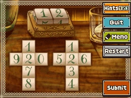

# Question

You've decided to make a special pair of dice that can display each day of the month numerically on your desk, as shown by the 12 at the top of the image.

Each day must use both dice, however, which means single-digit days like the first and second of the month will display as 01 and 02, respectively.

You thought you had the design figured out, but the layouts below won't display all of the dates. Please choose exactly one digit from the twelve digits, and specify to which digit it should be changed, so that all dates in a month can be displayed with the two dices.

# Source

[Professor Layton and the Unwound Future, puzzle 81](https://layton.fandom.com/wiki/Puzzle:Diced_Dates)