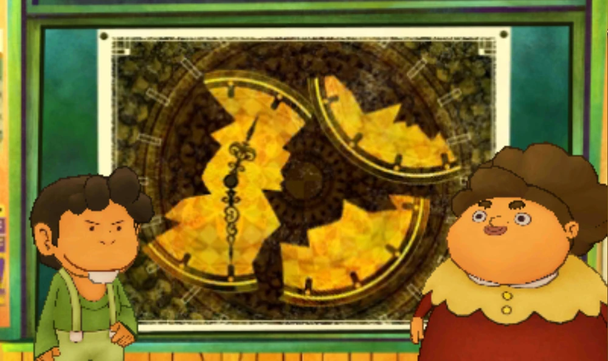

# Question

A teacher asks a student if he knows how to tell the time. The student nods, so the teacher presents him with the following puzzle:

"This wall clock fell down and broke into three pieces. You can't see the numbers from here, but I can tell you that the total of the numbers on each of the three pieces is the same. So, can you tell me what time this clock is showing?"

According to this clock, what time is it?

# Source
[Professor Layton and the Azran Legacy, puzzle 87](https://layton.fandom.com/wiki/Puzzle:A_Shamefaced_Clock)