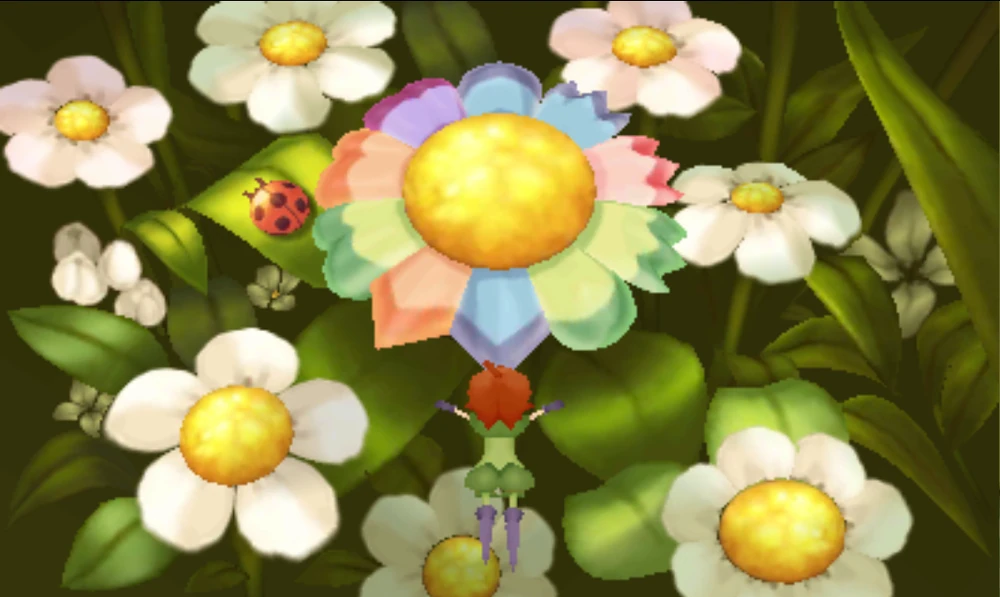

# Question

A flower with very unique petals sits in a garden as shown in the image. However, it seems as if the petals are not correctly arranged.

The flower pixie thinks they should be arranged so that each petal is next to a petal of either the same colour or shape.

How to arrange the petals on the flower so that they follow the flower pixie's instructions? There are 12 petals, so let's use numbers 1-12 to label the petals. For example, the blue round petal currently on the top is petal 12, and the blue sword-tip petal currently at the bottom is petal 6.

# Source

[Professor Layton vs. Phoenix Wright: Ace Attorney, puzzle 24](https://layton.fandom.com/wiki/Puzzle:Pretty_Posey)